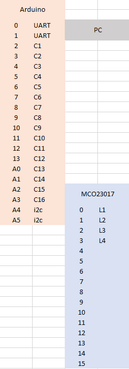

# Arduino sketches and notes

## Cube

### Snake game notes

Thinking about Richards idea about a playing a game of snake in the cube.

* Keyboard issue - how do you navigate the snake with the arrow keys given the X,Y **and Z** axes?  
  * Possibly use the ctrl/shift keys for Z  
  * Possibly run the snake round the sides, top and bottom  

Here is the pin layout proposal -  
C = Column  
L = Layer  

 

