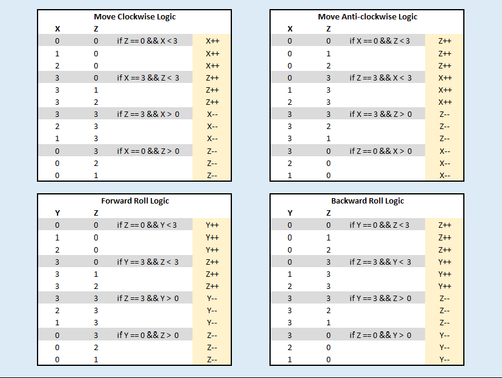
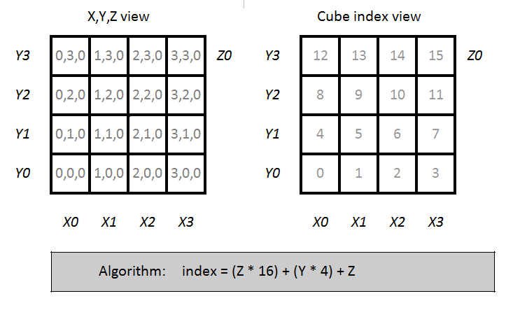
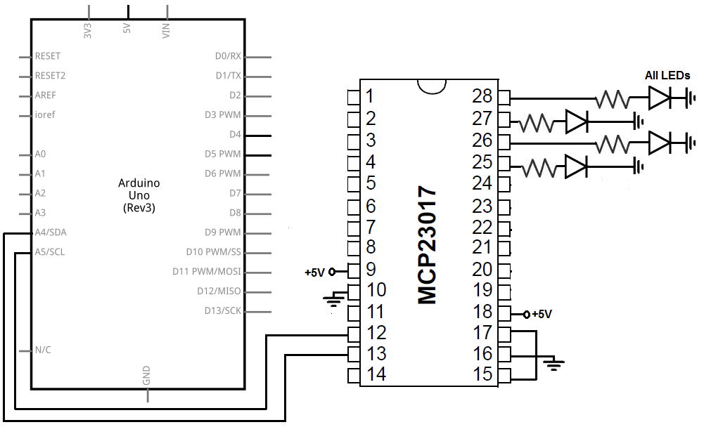

# Arduino sketches and notes

* [SnowFlake](https://create.arduino.cc/projecthub/tyjoh_tech/freeform-snowflake-dc34a8?utm_campaign=new_projects&utm_content=1&utm_medium=email&utm_source=hackster&utm_term=project_name)

## Cube

### Snake game notes

Thinking about Richards idea about a playing a game of snake in the cube.

* Keyboard issue - how do you navigate the snake with the arrow keys given the X,Y **and Z** axes?  
  * Possibly use the ctrl/shift keys for Z  
  * Possibly run the snake round the sides, top and bottom  
I think this will work using this movement logic:  
		

This is how we can index a single LED -  

  
Here is the pin layout proposal -  

 

